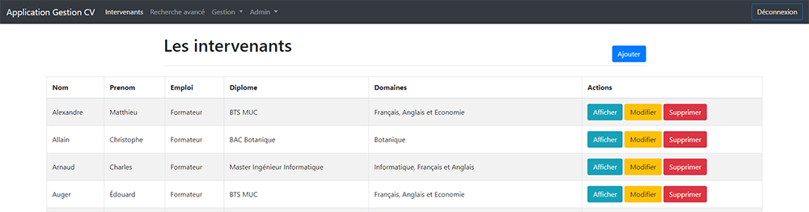

<div align="center">
    <p>
        
    </p>
</div>

## Introduction

Ce projet a été développé dans le cadre d'un stage de 2e année de BTS afin de numériser la gestion des CV et informations des intervenants dans l'entreprise.

## Sommaire

- [Installation](#installation)
- [La connection](#la-connection)
- [Les rôles](#les-rôles)

## Installation

Il est requis d'avoir la version 7.1.3 ou supérieur de PHP.

Ainsi qu'un environnement pour stocker l'application web et sa base de données, MySQL.

Ensuite, veuillez télécharger le [projet prêt pour la production](https://github.com/AH-REM/gestion-cv/releases/download/v1.0/gestion-cv.zip) ainsi que le [script de la base de données](https://github.com/AH-REM/gestion-cv/releases/download/v1.0/gestion-cv.sql).

Dans le fichier `.env`, vous devrez modifier la ligne suivante avec les bonnes informations.
```
DATABASE_URL="mysql://<db_user>:<db_password>@<ip>/<db_name>?serverVersion=5.7"
````

## La connection

Lors de la première connection, si n'avez pas modifié le script.
L'identifiant et le mot de passe son `admin`.

## Les rôles

Lors de la création d'un nouvel utilisateur, vous pouvez lui ajouter un rôle afin qu'il ai plus de permission.

- Aucun role : L'utilisateur a accès uniquement à l'affichage des intervenants et de la recherche avancé.
- Gestionnaire : Le gestionnaire peut en plus créer, modifier et supprimer les éléments.
- Administrateur : L'administrateur a tous les pouvoirs, il peut également créer de nouveau utilisateur.
